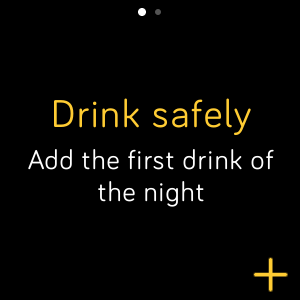
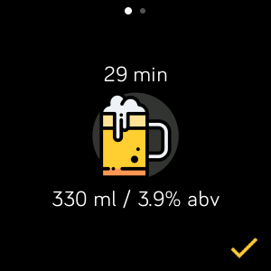
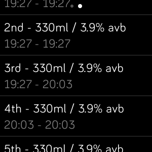

# Drink tracker

Drink tracker is a weekend project that helps you keep track of how many drink you have taken so far, it uses the device file system.

## Screenshots




## Gallery App Manager Link

https://gam.fitbit.com/apps/b411cdee5a52

You can install the app from here

https://gallery.fitbit.com/details/dd13bee8-dfe9-4b00-b701-d2286823c0da

## How to test on emulator
```
npx fitbit
fitbit$ bi
```

## Space for improvement
This features are planned but not developed:
- Change active drink volume and alcohol by voloume
- Save drink template
- Change active drink image
- Delete from history confirmation dialog
- Clear all history